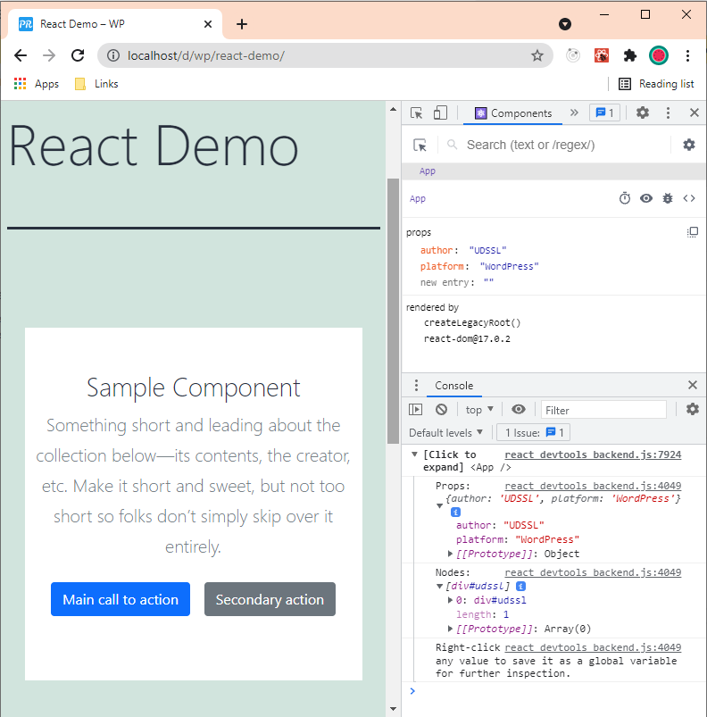

# WordPress React Template

Use the shortcode [udssl_react] to insert a custom-namespaced Bootstrap styled React Component into any WordPress page or post. Use this template code to start designing your Custom React component for WordPress.

## Installation

1. Download the plugin.
2. Install the plugin.
3. use [udssl_react] shortcode.

# To Develop Further

1. Install Dependancies

```
npm install
```

2. Develop using webpack --watch

```
npm run develop
```

3. Build for production

```
npm run build
```

# References for a New Project

```
npm install --save-dev webpack webpack-cli

npm install --save-dev sass-loader sass style-loader css-loader

npm install --save-dev babel-loader @babel/core  @babel/preset-env @babel/preset-react

npm install --save react react-dom bootstrap

npx prettier --write .

```

# Screenshot


